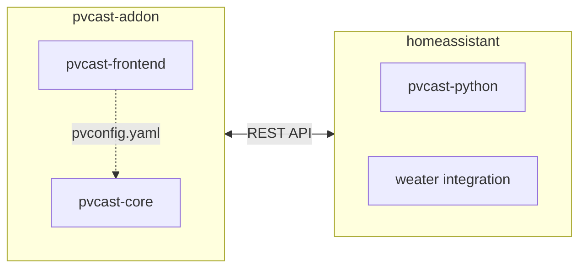

# pvcast

```mermaid
flowchart LR


    subgraph pvcast-addon
        direction TB
        B[pvcast-core]
        F[pvcast-frontend]

        F .->|pvconfig.yaml| B
    end

    subgraph homeassistant
        C[pvcast-python]
        E[weater integration]

        direction RL
    end

pvcast-addon <-->|REST API| homeassistant
```