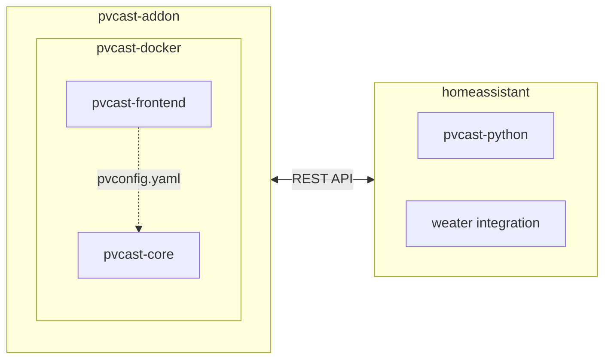
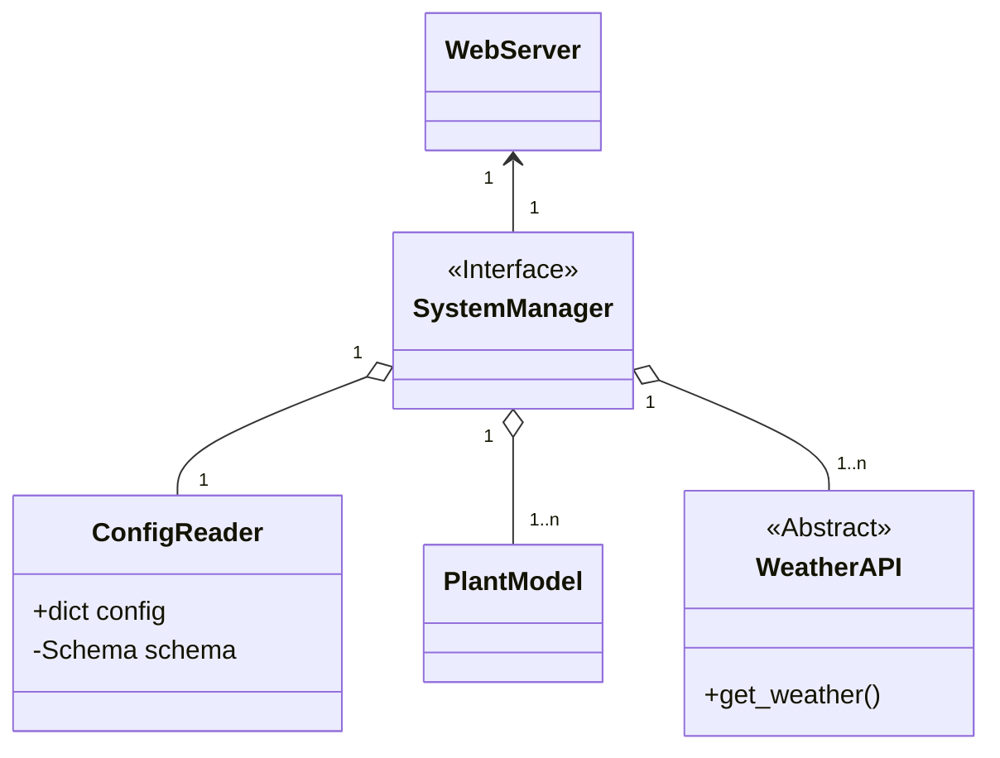

# pvcast

The software architecture of the entire project looks something like this (preliminary):

```mermaid
flowchart LR

    subgraph pvcast-addon
        subgraph pvcast-docker
            direction TB
            B[pvcast-core]
            F[pvcast-frontend]

            F .->|pvconfig.yaml| B
        end
    end

    subgraph homeassistant
        C[pvcast-python]
        E[weater integration]

        direction RL
    end

pvcast-addon <-->|REST API| homeassistant
```

While the class diagram of `pvcast-core` looks like this:

```mermaid
classDiagram
    class ConfigReader{
        +dict config
        -Schema schema
    }


    class WebServer{
    }

    class WeatherAPI{
        <<Abstract>>
        +get_weather()
    }

    class PlantModel{
    }

    class SystemManager{
        <<Interface>>
    }

    %% connections
    SystemManager "1" o-- "1" ConfigReader
    SystemManager "1" o-- "1..n" PlantModel
    SystemManager "1" o-- "1..n" WeatherAPI
    WebServer "1" <-- "1" SystemManager

    %% WeatherSource <|-- HAEntity
    %% WeatherSource <|-- OpenMeteo
    %% Webserver <-- PVPlantModel
    %% PVPlantModel <-- ConfigReader
    %% Webserver <-- WeatherSource
```
